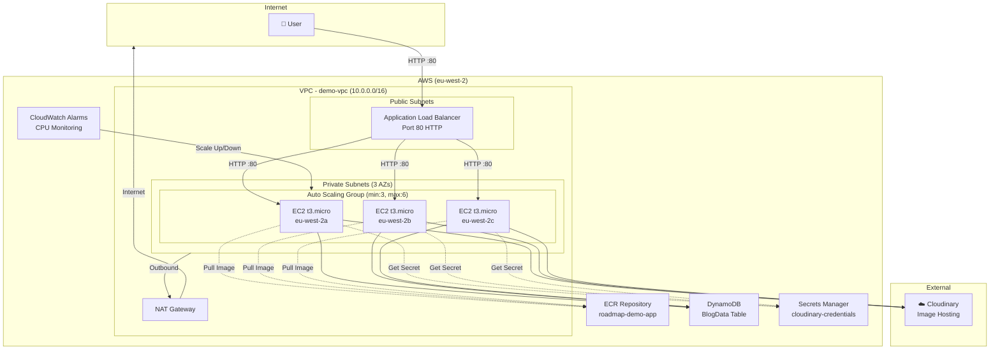
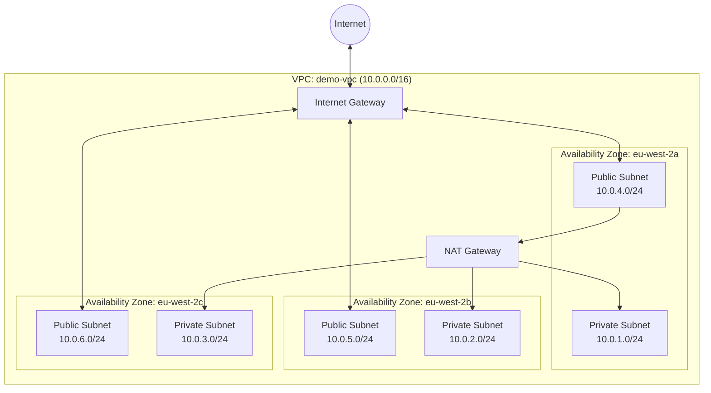
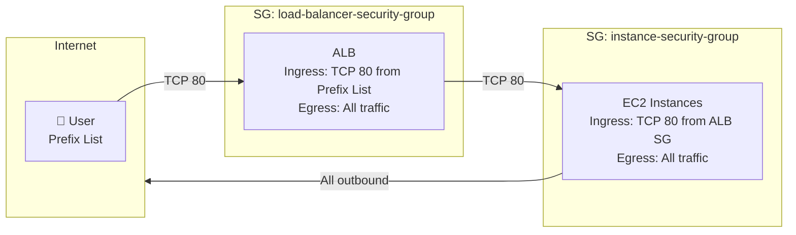
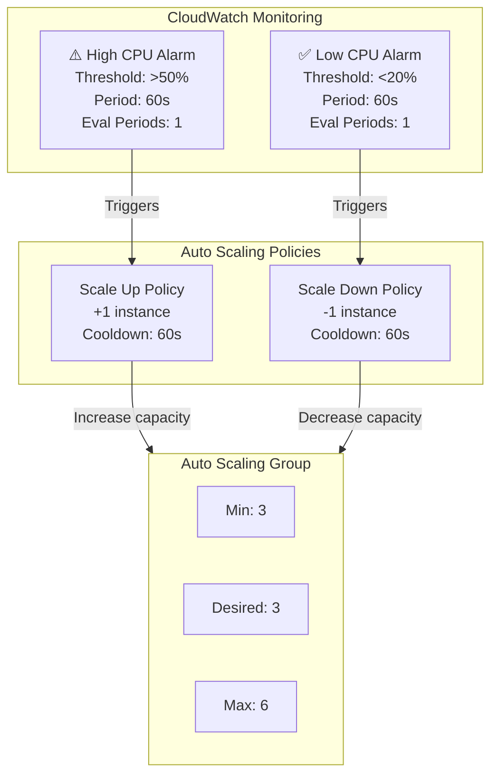
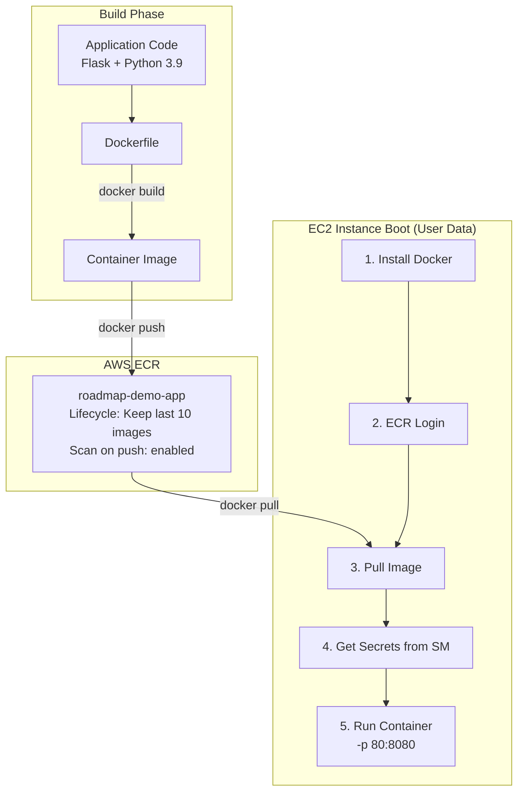
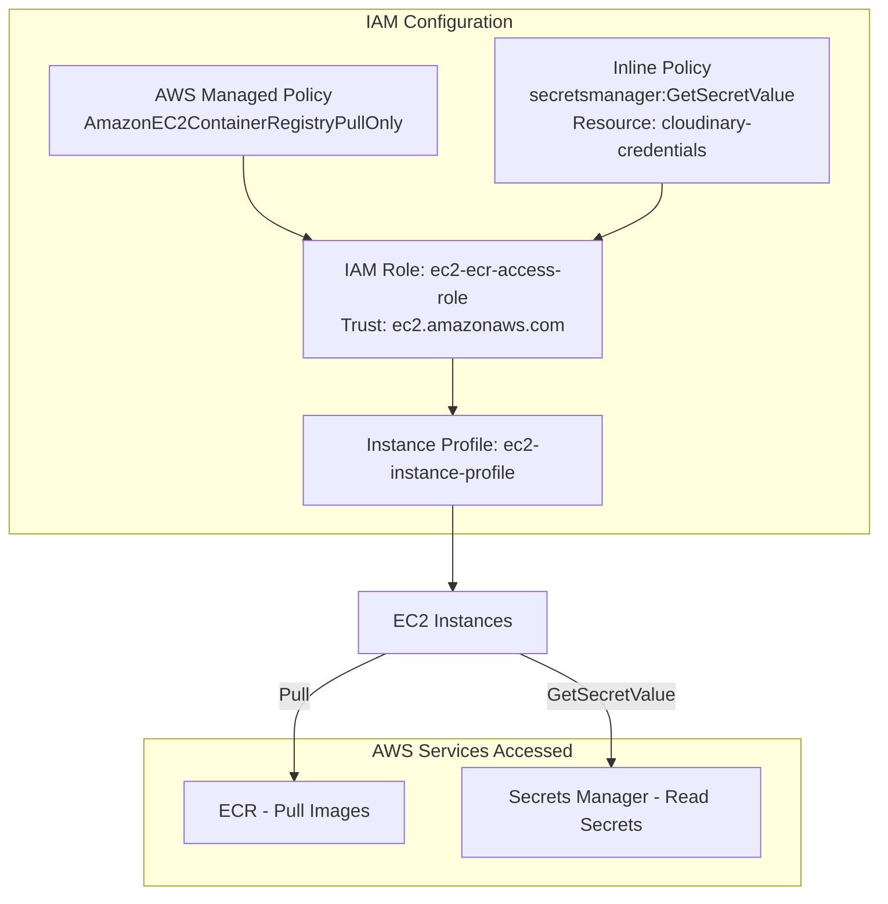
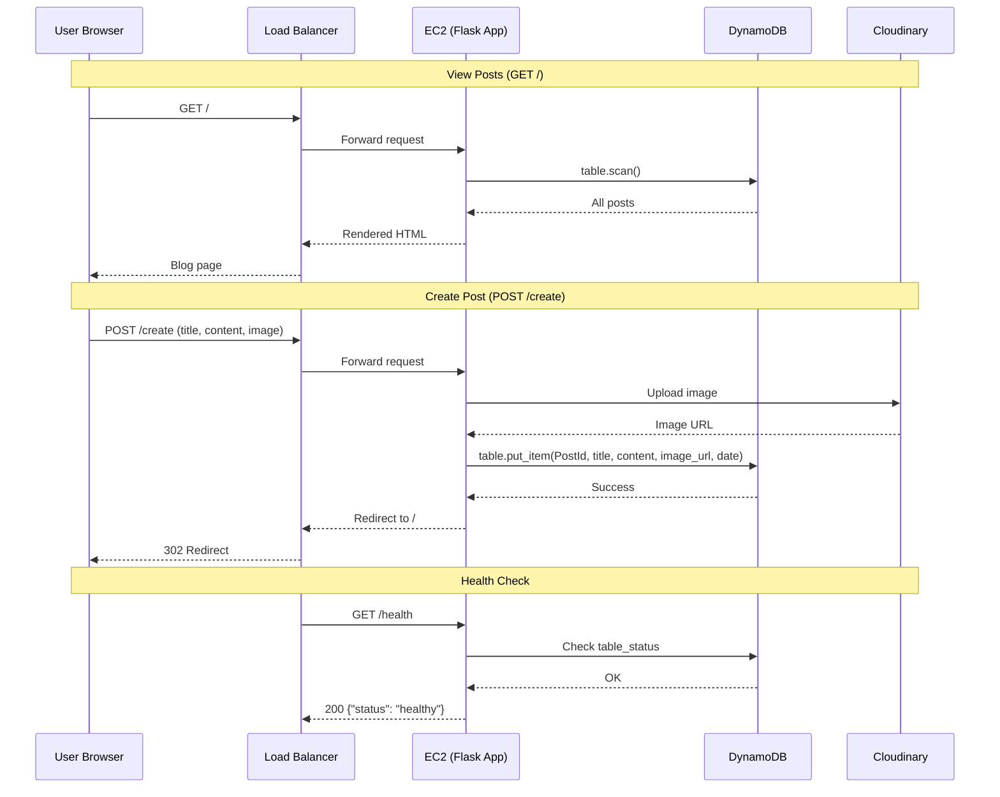

# Infrastructure Diagrams — roadmap-demo-05-feb-26

## 1. High-Level Architecture

## 2. Network Architecture

## 3. Security Groups & Traffic Flow

## 4. Auto Scaling & Monitoring

## 5. Application Deployment Flow

## 6. IAM & Permissions

## 7. Application Data Flow

## Summary Table

| Component | Resource | Details |
|-----------|----------|---------|
| **Network** | VPC | 10.0.0.0/16, 3 AZs, NAT Gateway |
| **Compute** | EC2 (ASG) | t3.micro, Amazon Linux 2023, min 3 / max 6 |
| **Load Balancer** | ALB | Public-facing, HTTP:80, health check on /health |
| **Container Registry** | ECR | roadmap-demo-app, scan on push, keep last 10 |
| **Database** | DynamoDB | BlogData table, PAY_PER_REQUEST, hash key: PostId |
| **Secrets** | Secrets Manager | Cloudinary credentials (cloud_name, api_key, api_secret) |
| **Monitoring** | CloudWatch | CPU alarms at >50% (scale up) and <20% (scale down) |
| **IAM** | Role + Profile | ECR pull + Secrets Manager read |
| **External** | Cloudinary | Image upload and hosting |